# **Personal Finance App - Subscription Tracker**
## **Comprehensive System Specifications**

---

## **📋 1. System Overview**

### **1.1 Purpose & Scope**
A self-hosted personal finance application focused exclusively on subscription management through Gmail integration. The system enables users to connect multiple Gmail accounts using individual OAuth credentials, automatically extract subscription information from emails using AI, and manage their recurring expenses through a modern web interface.

### **1.2 Core Objectives**
- **Multi-Account Gmail Integration**: Support unlimited Gmail accounts per user with individual OAuth configurations
- **AI-Powered Subscription Detection**: Automatically identify and extract subscription details from email content
- **Self-Hosted Deployment**: Complete control over data with no external dependencies for core functionality
- **Subscription Lifecycle Management**: Track, analyze, and manage subscription services across all connected accounts

### **1.3 Technical Stack Decision**
- **Frontend**: Next.js with TypeScript, Tailwind CSS, shadcn/ui
- **Backend**: Express.js with TypeScript
- **Database**: PostgreSQL 
- **AI Integration**: MCP (Model Context Protocol) with Streamable HTTPS
- **Authentication**: JWT-based with bcrypt password hashing
- **Email Processing**: Gmail API with OAuth 2.0 per account
- **Deployment**: Docker containerization for self-hosting

---

## **🏗️ 2. System Architecture**

### **2.1 High-Level Architecture Diagram**

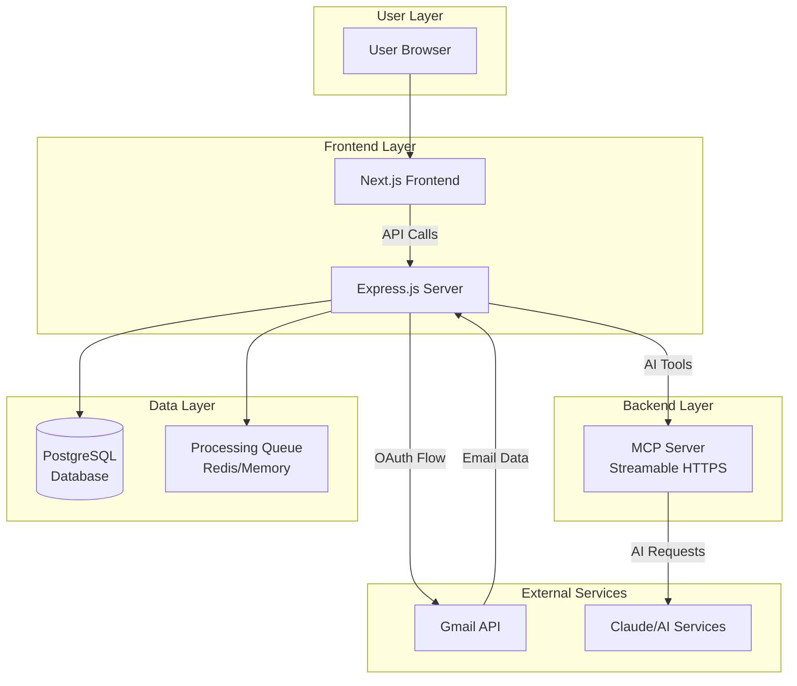

### **2.2 System Components Architecture**

#### **2.2.1 Frontend Architecture**
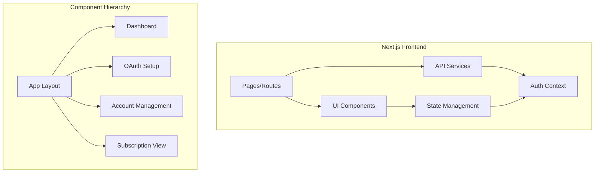

#### **2.2.2 Backend Architecture**
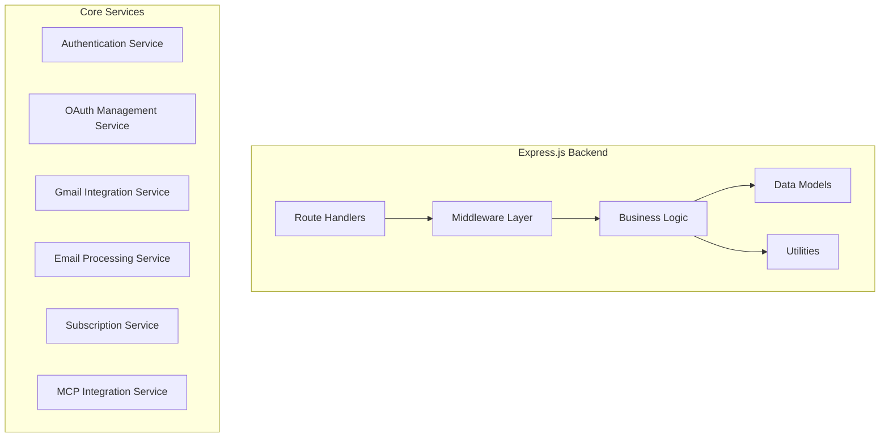

---

## **🔐 3. Authentication & Authorization Architecture**

### **3.1 User Authentication Flow**

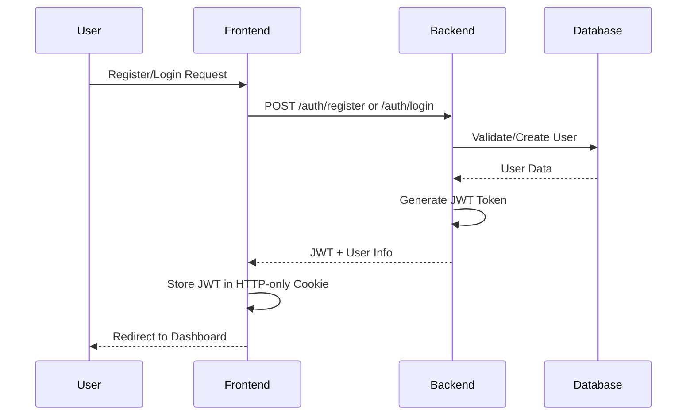

### **3.2 Authentication Components**

#### **3.2.1 User Registration System**
- **Email Validation**: Unique email constraint with format validation
- **Password Security**: bcrypt hashing with minimum complexity requirements
- **Account Initialization**: Create default categories and user preferences
- **Welcome Flow**: Guide user to OAuth setup immediately after registration

#### **3.2.2 Session Management**
- **JWT Strategy**: Stateless authentication with HTTP-only cookies
- **Token Expiration**: 7-day expiration with refresh token mechanism
- **Security Headers**: CSRF protection and secure cookie settings
- **Session Persistence**: Optional "Remember Me" functionality

---

## **🔑 4. OAuth Integration Architecture**

### **4.1 Per-Account OAuth Strategy**

The system implements a sophisticated OAuth management system where each Gmail account requires its own set of OAuth credentials, similar to n8n's approach. This design enables:

- **Complete User Control**: Users provide their own Google Cloud Project credentials
- **Unlimited Accounts**: No restrictions on number of connected Gmail accounts
- **Data Sovereignty**: No shared OAuth applications that could be rate-limited or suspended
- **Compliance**: Users maintain control over their own API quotas and usage

### **4.2 OAuth Flow Architecture**

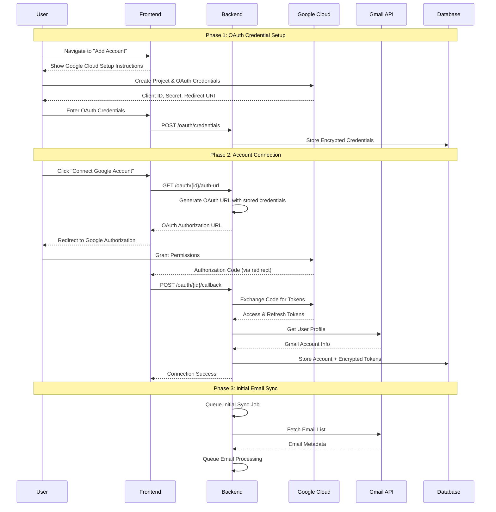

### **4.3 OAuth Credential Management**

#### **4.3.1 Storage Strategy**
- **Encryption at Rest**: All OAuth secrets encrypted using AES-256
- **Key Management**: Encryption keys stored separately from database
- **Access Control**: Credentials only accessible to owning user
- **Audit Trail**: Track credential creation, usage, and modification

#### **4.3.2 Token Lifecycle Management**
- **Automatic Refresh**: Proactive token refresh before expiration
- **Error Handling**: Graceful handling of revoked or expired tokens
- **Retry Logic**: Exponential backoff for failed API requests
- **User Notification**: Alert users when manual reauthorization needed

---

## **📧 5. Gmail Integration Architecture**

### **5.1 Email Synchronization Strategy**

The system implements a comprehensive email synchronization strategy that handles both historical data and real-time updates efficiently.

#### **5.1.1 Initial Synchronization Process**
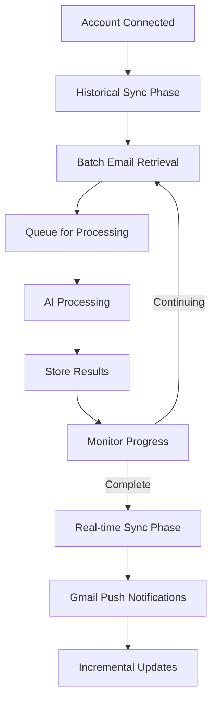

#### **5.1.2 Synchronization Components**

**Historical Data Sync**:
- **Batch Processing**: Retrieve emails in configurable batch sizes (default: 100 emails)
- **Date Range Filtering**: Configurable historical depth (default: 2 years)
- **Progress Tracking**: Real-time progress updates for user feedback
- **Resume Capability**: Handle interruptions and resume from last processed email
- **Rate Limiting**: Respect Gmail API quotas with intelligent throttling

**Real-time Sync**:
- **Push Notifications**: Gmail push notifications for immediate updates
- **Polling Fallback**: Periodic polling as backup for missed notifications
- **Incremental Processing**: Process only new emails since last sync
- **Duplicate Detection**: Prevent processing same email multiple times

### **5.2 Email Processing Pipeline**

#### **5.2.1 Processing Flow Architecture**
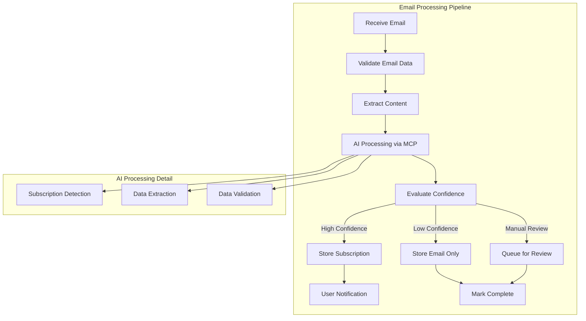

#### **5.2.2 Processing Components**

**Email Content Extraction**:
- **Multi-format Support**: Handle both HTML and plain text emails
- **Content Cleaning**: Remove signatures, headers, and irrelevant content
- **Language Detection**: Identify email language for better AI processing
- **Metadata Extraction**: Sender information, dates, and email classification

**AI Processing Integration**:
- **MCP Tool Invocation**: Call subscription extraction tools via MCP server
- **Context Building**: Provide rich context to AI including sender patterns
- **Confidence Scoring**: Evaluate reliability of AI extraction results
- **Fallback Strategies**: Handle AI processing failures gracefully

---

## **🤖 6. MCP (Model Context Protocol) Architecture**

### **6.1 MCP Server Design**

The MCP server operates as a dedicated service providing AI-powered tools for email analysis and subscription extraction. It uses the Streamable HTTPS transport protocol for real-time communication and progress updates.

#### **6.1.1 MCP Server Architecture**
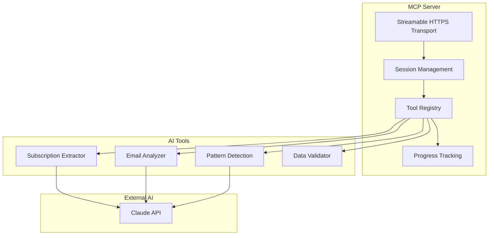

#### **6.1.2 Tool Implementation Strategy**

**Subscription Extraction Tool**:
- **Input Processing**: Clean and structure email content for AI analysis
- **Prompt Engineering**: Sophisticated prompts for accurate subscription detection
- **Output Standardization**: Consistent JSON schema for extracted data
- **Confidence Scoring**: Provide reliability metrics for extracted information

**Pattern Detection Tool**:
- **Sender Analysis**: Identify patterns in subscription-related senders
- **Content Analysis**: Detect recurring billing notifications and patterns
- **Learning Capability**: Improve detection based on user feedback
- **Custom Rules**: Allow users to define custom subscription patterns

### **6.2 MCP Communication Protocol**

#### **6.2.1 Request/Response Flow**
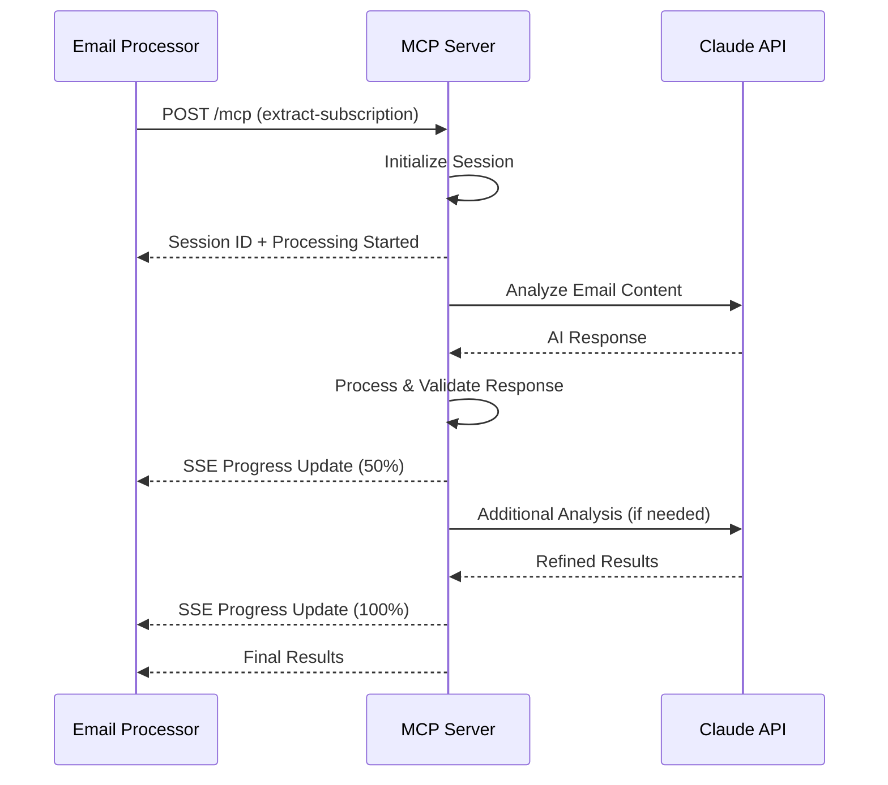

#### **6.2.2 Session Management**
- **Session Persistence**: Maintain state across multiple tool calls
- **Progress Tracking**: Real-time progress updates via Server-Sent Events
- **Error Recovery**: Handle network interruptions and AI service failures
- **Resource Management**: Automatic cleanup of completed sessions

---

## **💾 7. Data Architecture**

### **7.1 Database Design Philosophy**

The database design follows principles of data sovereignty, audit trails, and extensibility while maintaining performance for real-time operations.

#### **7.1.1 Data Model Relationships**
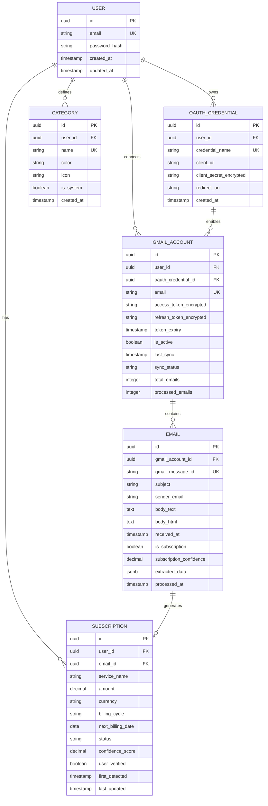

### **7.2 Data Flow Architecture**

#### **7.2.1 Email Processing Data Flow**
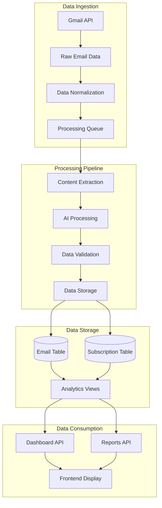

### **7.3 Data Security & Privacy**

#### **7.3.1 Security Layers**
- **Encryption at Rest**: All sensitive data encrypted using industry-standard algorithms
- **Access Control**: Role-based access with user isolation
- **Audit Logging**: Comprehensive audit trail for all data operations
- **Data Retention**: Configurable retention policies for compliance
- **Backup Strategy**: Automated encrypted backups with point-in-time recovery

#### **7.3.2 Privacy Compliance**
- **Data Minimization**: Store only necessary email content and metadata
- **User Control**: Complete user control over data deletion and export
- **Consent Management**: Clear consent for data processing activities
- **Data Portability**: Export functionality for user data in standard formats

---

## **📱 8. Frontend Architecture**

### **8.1 User Interface Design System**

#### **8.1.1 Design Principles**
- **Dark Mode First**: Optimized for dark environments with green accent color
- **Mobile Responsive**: Progressive enhancement from mobile to desktop
- **Accessibility**: WCAG 2.1 AA compliance with keyboard navigation
- **Performance**: Optimized loading with skeleton screens and lazy loading

#### **8.1.2 Component Architecture**
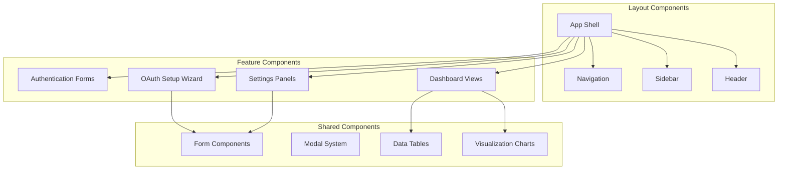

### **8.2 State Management Architecture**

#### **8.2.1 State Flow Design**
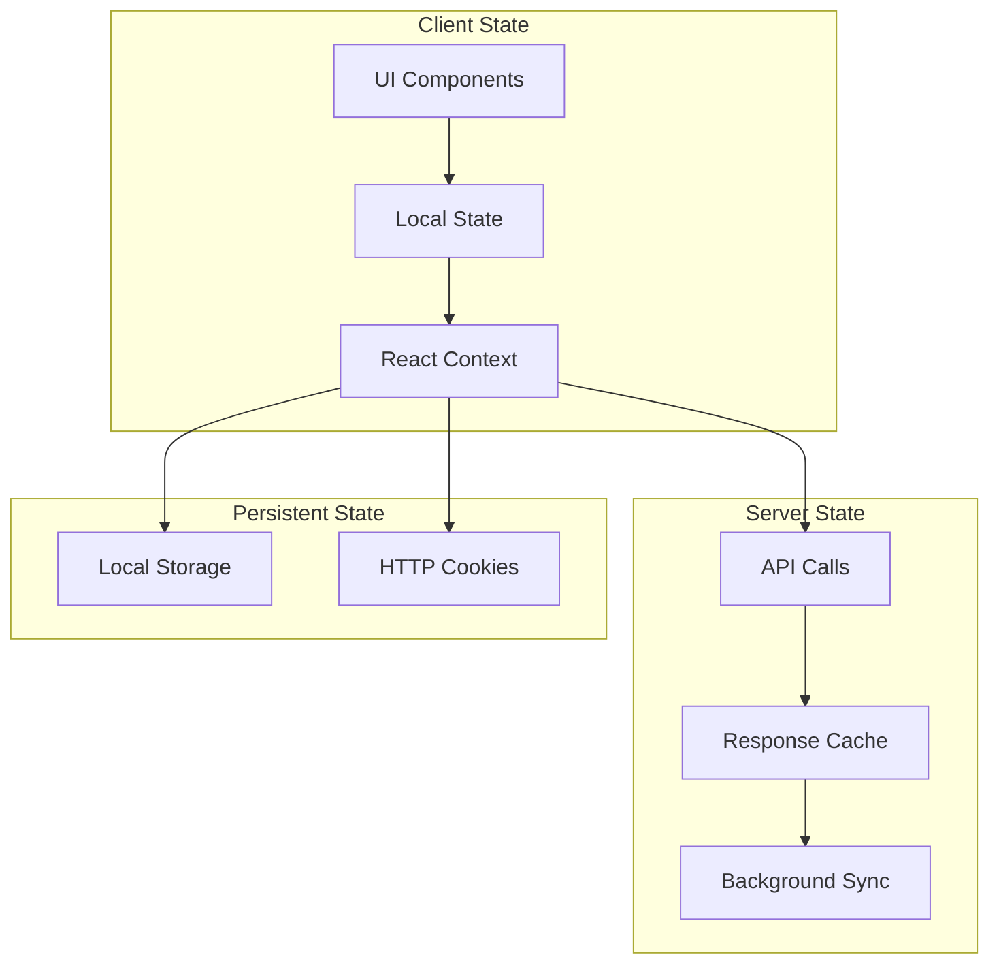

### **8.3 User Experience Flow**

#### **8.3.1 Onboarding Sequence**
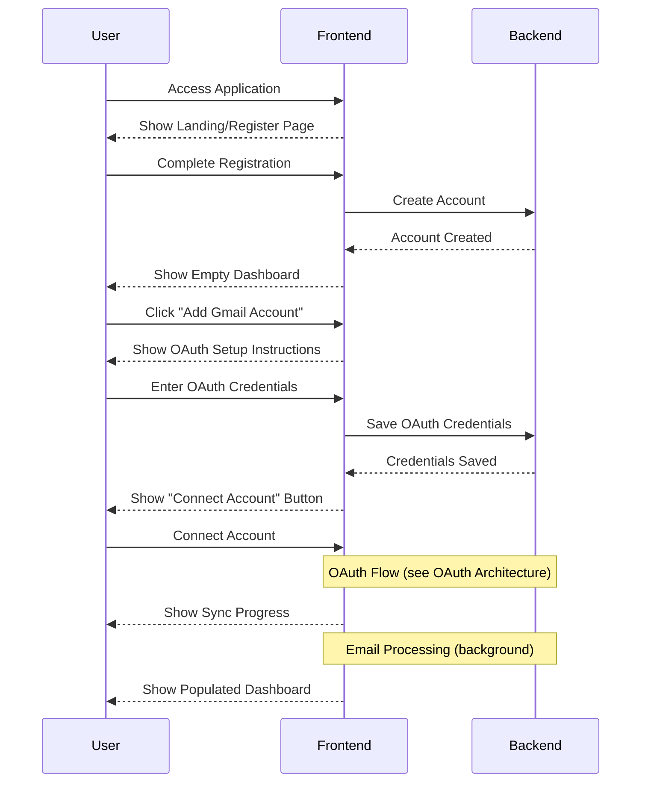

---

## **🔄 9. System Integration & Communication**

### **9.1 Inter-Service Communication**

#### **9.1.1 Communication Patterns**
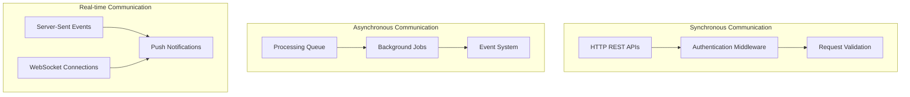

### **9.2 External Service Integration**

#### **9.2.1 Gmail API Integration Strategy**
- **Rate Limiting**: Intelligent throttling based on quota usage and user limits
- **Error Handling**: Comprehensive error recovery for network and API failures
- **Caching Strategy**: Cache email metadata to reduce API calls
- **Bulk Operations**: Batch API requests for improved efficiency

#### **9.2.2 AI Service Integration**
- **Model Selection**: Configurable AI models based on task complexity
- **Fallback Strategies**: Multiple AI providers for redundancy
- **Cost Optimization**: Request caching and result reuse
- **Quality Assurance**: Confidence scoring and human review workflows

---

## **🚀 10. Deployment Architecture**

### **10.1 Self-Hosting Strategy**

#### **10.1.1 Containerization Architecture**
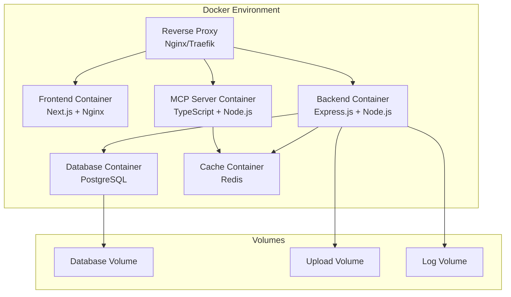

### **10.2 Configuration Management**

#### **10.2.1 Environment Configuration**
- **Environment Variables**: All configuration via environment variables
- **Secrets Management**: Secure handling of API keys and database credentials  
- **Feature Flags**: Runtime feature toggles for gradual rollouts
- **Health Checks**: Comprehensive health monitoring for all services

#### **10.2.2 Monitoring & Logging**
- **Application Metrics**: Performance monitoring with custom dashboards
- **Error Tracking**: Centralized error logging and alerting
- **Audit Trails**: Complete audit logs for security and compliance
- **Resource Monitoring**: CPU, memory, and disk usage tracking

---

## **🔧 11. Development & Maintenance**

### **11.1 Development Workflow**

#### **11.1.1 Code Organization**
- **Monorepo Structure**: Single repository with clear module boundaries
- **Shared Libraries**: Common utilities and types across frontend and backend
- **Type Safety**: End-to-end TypeScript for compile-time error detection
- **Testing Strategy**: Unit, integration, and end-to-end testing frameworks

### **11.2 Quality Assurance**

#### **11.2.1 Testing Architecture**
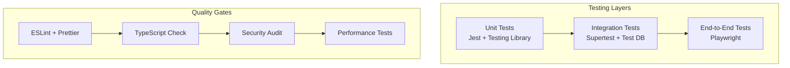

### **11.3 Maintenance Strategy**

#### **11.3.1 Update Management**
- **Dependency Updates**: Automated security updates with manual review for major versions
- **Database Migrations**: Versioned schema migrations with rollback capabilities  
- **Configuration Updates**: Hot-reloading for non-critical configuration changes
- **Feature Deployment**: Blue-green deployment strategy for zero-downtime updates
